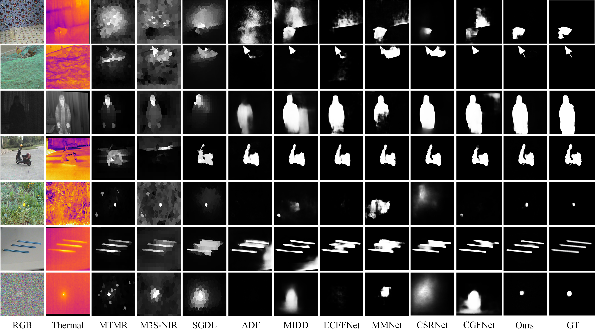

# SwinNet: Swin Transformer drives edge-aware RGB-D and RGB-T salient object detection
****


Pytorch implementation of the paper SwinNet: Swin Transformer drives edge-aware RGB-D and RGB-T salient object detection(The paper has been accepted by IEEE Transactions on Circuits and Systems for Video Technology. The details are in [paper](https://ieeexplore.ieee.org/document/9611276))，For more details, please(https://github.com/liuzywen)

Authors:[zhengyi Liu](https://github.com/liuzywen), [Yacheng Tan](https://github.com/caigentan), Qian He, Yun Xiao


****
# Prerequisites
****
+ 
+ 
+ 
+ 
+ 
+ 
+ 

# Data Preparation
****
Put the raw data under the following directory:

    ─ datasets\
     |─ RGB-D\
          ├─ test\
                |─···
     |────├─ train\
                |─···
     |    └─ validation\
                |─···
     |─ RGB-T\
          ├─ Train\
                |─···
          ├─ test\
                |─···
          └─ validation\
                |─···

# Training
****
* Downloading necessary data: [swin_base_patch4_window12_384_22k.pth](https://github.com/SwinTransformer/storage/releases/download/v1.0.0/swin_base_patch4_window12_384_22k.pth)
* Put the Pretrained models under Pre_train\ directory.
* After you download training dataset, just run SwinNet_train.py to train our model.

# Testing
****
* After you download all the pre-trained model and testing dataset, just run SwinNet_test.py to generate the final prediction map.
* evaluation_tools start from [Saliency-Evaluation-Toolbox](https://github.com/jiwei0921/Saliency-Evaluation-Toolbox)

# Results
****
### RGB-D
| dataset | Smeasure ↑ | aFmeasure ↑ |Emeasure ↑ | MAE ↓ | 
| :---: | :---: | :---: | :---: | :---: | 
| NLPR | 0.941 | 0.908 | 0.967 | 0.018 |
| NJU2K | 0.935 | 0.922 | 0.934 | 0.027 |
| STERE | 0.919 | 0.893 | 0.929 | 0.033 |
| DES | 0.945 | 0.926 | 0.980 | 0.016 |
| SIP | 0.911 | 0.912 | 0.943 | 0.035 |
| DUT | 0.949 | 0.944 | 0.968 | 0.020 |
### RGB-T
| dataset | Smeasure ↑ | aFmeasure ↑ |Emeasure ↑ | MAE ↓ | 
| :---: | :---: | :---: | :---: | :---: | 
| VT821 | 0.904 | 0.847 | 0.926 | 0.030 |
| VT1000 | 0.938 | 0.896 | 0.947 | 0.018 |
| VT5000 | 0.912 | 0.865 | 0.924 | 0.026 |

# Saliency map
****
All of the saliency maps mentioned in the paper are available on [GoogleDrive](https://drive.google.com/drive/folders/1UG3HzVbl9etPgZorkGAZrHYmzUQmPz6S?usp=sharing), [OneDriver](https://1drv.ms/u/s!AuFm6rk_AONSjzOWm6F7NMogzkl1?e=jclfMu), [BaiduPan-code:](), [AliyunDriver](https://www.aliyundrive.com/s/BxnZfHBRnye)


# Visual comparison
****

<p align="center">RGB-D Visual comparison</p>


<p align="center">RGB-T Visual comparison</p>


## Citation
If you find this work or code useful, please cite:

```
@ARTICLE{9611276,
  author={Liu, Zhengyi and Tan, Yacheng and He, Qian and Xiao, Yun},
  journal={IEEE Transactions on Circuits and Systems for Video Technology}, 
  title={SwinNet: Swin Transformer drives edge-aware RGB-D and RGB-T salient object detection}, 
  year={2021},
  volume={},
  number={},
  pages={1-1},
  doi={10.1109/TCSVT.2021.3127149}}
``
